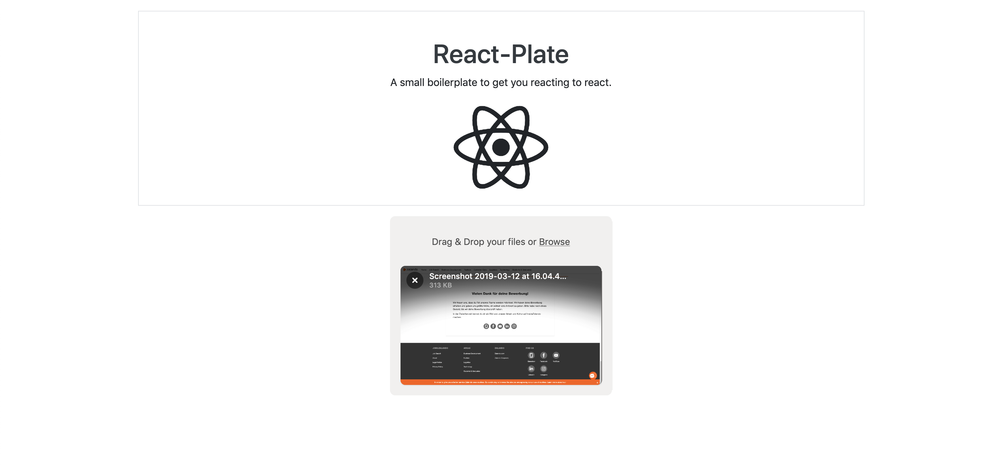

# File-Uploads powered by FilePond and React



This is a minimal react boilerplate powered by [React Scripts](https://github.com/facebook/create-react-app/blob/master/packages/react-scripts/template/README.md) configured with:

- React
- Bootstrap 4
- Font-Awesome
- Node-Sass-chokidar
- **Extra:** .gitignore file for all operating systems.

## Quick Start

1. Clone the repository into your project folder
   <br>

```bash
git clone git@github.com:Leon-Arno/React-Plate.git .
```

<br>
2. Remove the .git directory to add your own repository

```bash
rm -rf .git
```

<br>
3. Update the package.json file where necessary.
   e.g

```JSON
   {
     "name": "your-project-name",
     "description": "your project description",
     "author": "Your Name",
     "license": "MIT",
   }
```

<br>
<br>
4. Install the required dev-dependencies

```bash
npm install
```

**and**

```bash
npm update
```

to update the dev-dependencies from their initial versions.
<br>
<br>
<br>

5. To start, run the dev command

```bash
npm start
```

This runs the app in dev mode. A browser tab will be automatically opened.<br>
In case a tab isn't opened, simply go to this address [http://localhost:3000](http://localhost:3000) on your browser.<br>
**Note: to stop the dev-mode simply press `ctrl + c`**
<br>
<br>
<br>

6. To test, run

```bash
npm test
```

This launches the test runner in the interactive watch mode.<br>
See the section about [running tests](https://facebook.github.io/create-react-app/docs/running-tests) for more information.
<br>
<br>
<br>

7. To build, run the build command

```bash
npm run build
```

Builds the app for production to the `build` folder.<br>
It correctly bundles React in production mode and optimizes the build for the best performance.

The build is minified and the filenames include the hashes.<br>
Your app is ready to be deployed!

See the section about [deployment](https://facebook.github.io/create-react-app/docs/deployment) for more information.
<br>
<br>
<br>

8. To eject, run the dev command

```bash
npm run eject
```

**Note: this is a one-way operation. Once you `eject`, you can’t go back!**

If you aren’t satisfied with the build tool and configuration choices, you can `eject` at any time. This command will remove the single build dependency from your project.

Instead, it will copy all the configuration files and the transitive dependencies (Webpack, Babel, ESLint, etc) right into your project so you have full control over them. All of the commands except `eject` will still work, but they will point to the copied scripts so you can tweak them. At this point you’re on your own.

You don’t have to ever use `eject`. The curated feature set is suitable for small and middle deployments, and you shouldn’t feel obligated to use this feature. However we understand that this tool wouldn’t be useful if you couldn’t customize it when you are ready for it.
**- React-scripts Doc.**

## Learn More

You can learn more in the [Create React App documentation](https://facebook.github.io/create-react-app/docs/getting-started).

To learn React, check out the [React documentation](https://reactjs.org/).
